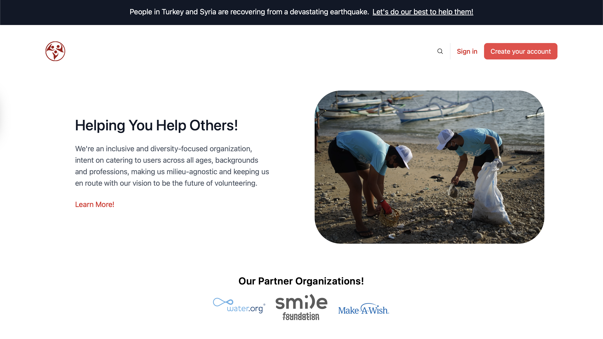

<h1 align="center">HelpinU</h1>
<p align="center">Helping you help the world</p>



<br >
 

HelpinU is a web application designed to connect individuals with organizations, fostering collaboration for volunteering and donations. Empower positive change by contributing your time, skills, or financial support to causes that matter.

## Features

### 1. Volunteer Opportunities

Explore a diverse range of volunteering opportunities posted by organizations dedicated to various social causes.

### 2. Donation Portal

Securely contribute to organizations financially through our user-friendly donation portal, supporting causes close to your heart.

### 3. User and Organization Profiles

Create your profile to track your volunteer history and donation records. Organizations can showcase their mission, ongoing projects, and volunteer requirements.

### 4. Easy Registration

Get started quickly by creating an account. Simplified registration ensures you can begin making a difference promptly.

### 5. Search and Filters

Efficiently find opportunities using search and filters based on location, cause, and time commitment. Tailor your experience to match your preferences.

## Getting Started

### Prerequisites

- [Python](https://www.python.org/downloads/)
- [Django](https://www.djangoproject.com/download/)

### Installation

1. Clone the repository:
   ```bash
   git clone https://github.com/your-username/HelpinU.git
